

<h1>Disnode</h1>

A real-time app for finding and connecting with communities sharing similar interests as you, making friends in the process - inspired by Discord.

Built with 
<a href="https://reactjs.org/">ReactJS</a>,
<a href="https://nodejs.org/en/">Node.js</a>, 
<a href="https://expressjs.com/">Express</a>, 
<a href="https://www.postgresql.org/">PostgreSQL</a>, 
<a href="https://mui.com/">Material-UI 5.3</a>, 
<a href="https://socket.io/">Socket.IO</a>,
<a href="https://aws.amazon.com/s3/">AWS (S3)</a>,
<a href="https://jwt.io/">JWT</a>,
and hosted with
<a href="https://www.netlify.com/">Netlify</a> &
<a href="https://www.heroku.com/">Heroku</a>

<b><a href="https://disnodejs.netlify.app/" target="_blank">
» View Live Demo «
</a></b>

> We all use one of chat applications every day. Before I started studying development, I wondered how chat apps are built. I could've found a piece of answers during Bootcamp. And since we (**[Adam](https://github.com/adamhirzalla), [Jonathan](https://github.com/hjonsu)**) had similar ideas that we wanted to create our own chat application, We decided to build **Disnode**.

## 📚 Introduction

[**Disnode**](https://disnodejs.netlify.app/) is a full-stack application that allows users to create or join existing servers, connecting with others that share similar interests.

### 🤝 **Collaborators**:

Each member focused mainly on different parts for this project, while also familiarizing each other with the rest of the application for context and also we tried our best to be involved with all the stack.

- Hyunsu Kim ([**@EavanK**](https://github.com/EavanK)) - _Middleman for backend/frontend (wire-ups), Front-end (React States/components), User Authorization - JWT (server + client) & API_
- Adam Hirzalla ([**@adamhirzalla**](https://github.com/adamhirzalla)) - _Back-end (server and API routes), DB Architecture (ERD/Schema/Queries + shaping data), Sockets (server + client), AWS-S3 (server + client) & Front-end (React Contexts/Reducers + refactors)_
- Jonathan Su ([**@hjonsu**](https://github.com/hjonsu)) - _Front-end (styling/design), MUI components & Wireframes_

> This app was created as part of our final project for Lighthouse Labs - Web Development Bootcamp. The goal was to create a full-stack application from start to finish in just two weeks.

## ⚛️ Stack and Tools

- **Frontend**:
  [ReactJS](https://reactjs.org/), [Material-UI 5.3](https://mui.com/), [Socket.io](https://socket.io/), [AWS (S3)](https://aws.amazon.com/s3/), [JWT](https://jwt.io/)
- **Backend**:
  [Node.js](https://nodejs.org/en/), [Express](https://expressjs.com/), [PostgreSQL](https://www.postgresql.org/), [Socket.io](https://socket.io/), [AWS (S3)](https://aws.amazon.com/s3/), [JWT](https://jwt.io/)
- **Deployment**:
  [Heroku](https://www.heroku.com/) (database API), [Netlify](https://www.netlify.com/) (production client)

<!-- FEATURES -->

## ⭐ Features

- Real-time events for almost all features (sockets)
- Users can customize their profiles, and add connections to their socials or other platforms, which other users can view
- Users can create or join multiple servers
- Users can search for existing servers through title/invite codes/tags, or browse through a list of all servers
- Each server can have as many channels, each having its own messages instance (used for categorization within a server)
- Users can add other users to their friends list
- Member role system (Owner, Admins, Users) with different permissions for each

## ✨ Special Features:

- Live seen-by feature for all messages
- Live online status indicator for server members
- Live tagging/mentioning other members in chat messages
- Live notifications for new messages and member tags/mentions
- Upload images, GIFs as profile pictures and server logos
- View other members' profiles and view their linked connections
- Members can accept/reject incoming friend requests, or cancel outgoing requests
- Server Admins can kick members from server, create/edit/delete server channels, and delete chat messages for moderation purposes
- A server Owner can promote members to Admins, pass down ownership to an Admin, and edit server settings
- Each role has different role colors which are used for chat messages to quickly identify the role of the sender by color
- Members can copy server invite codes to clipboard and share it with other members to find and join the server

## 📷 Screenshots

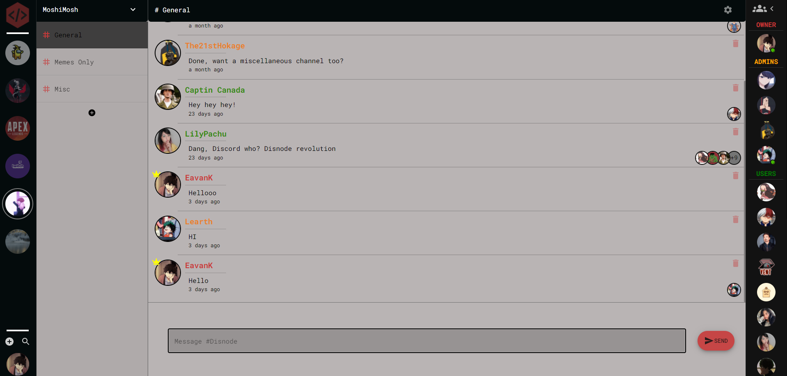
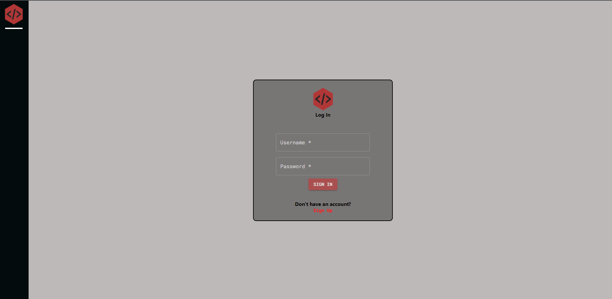
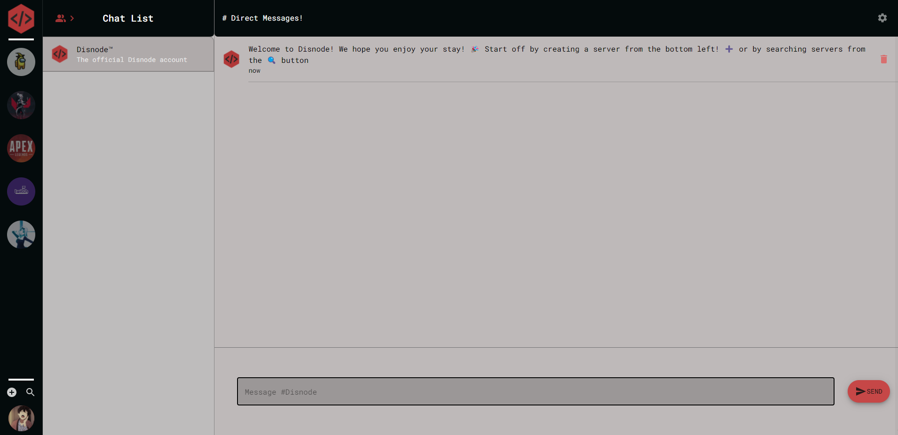
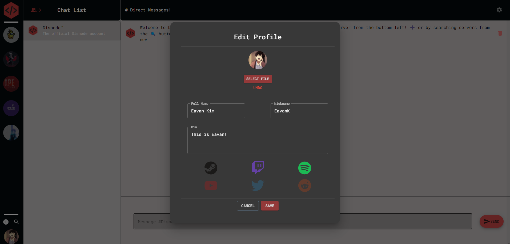

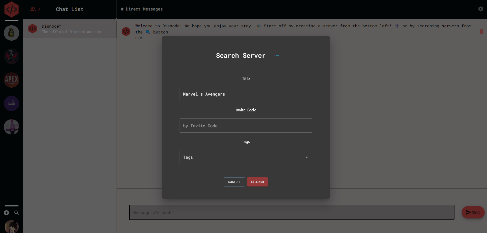
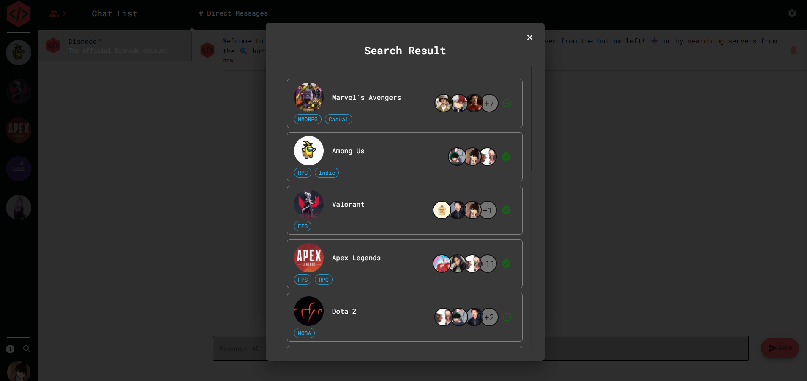
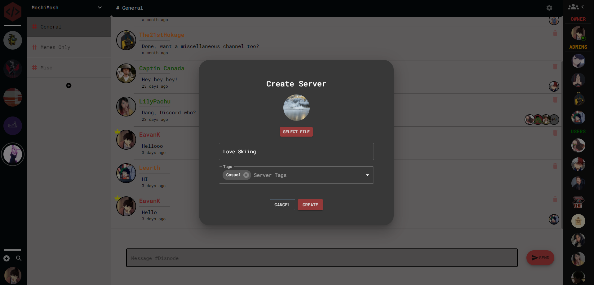
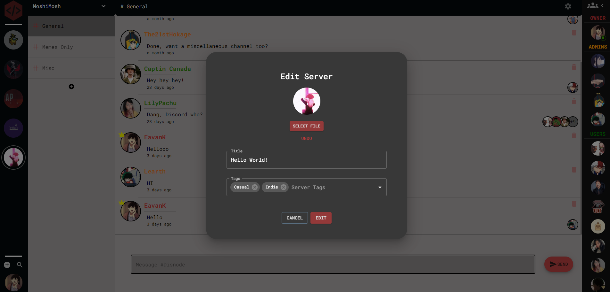

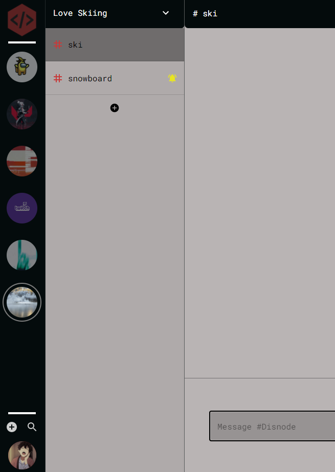
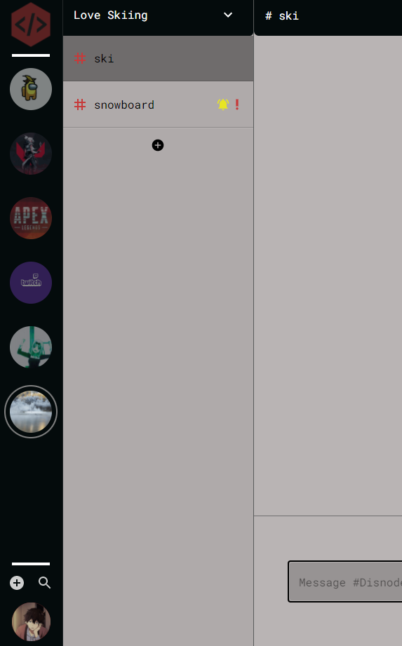

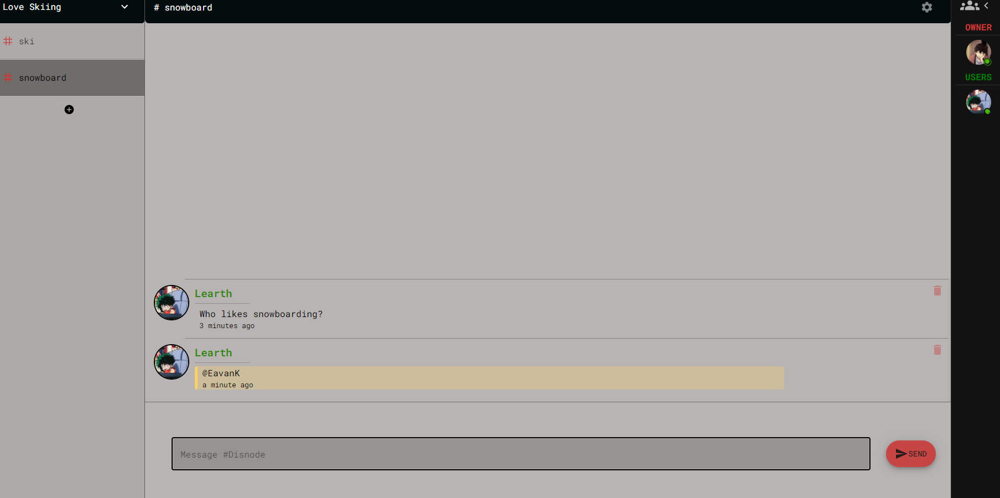
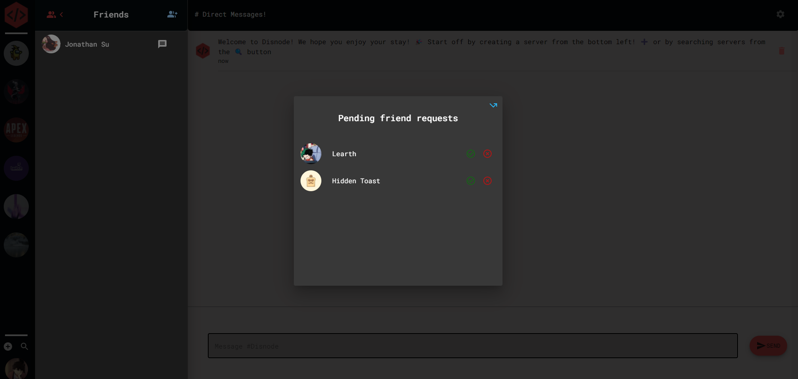
